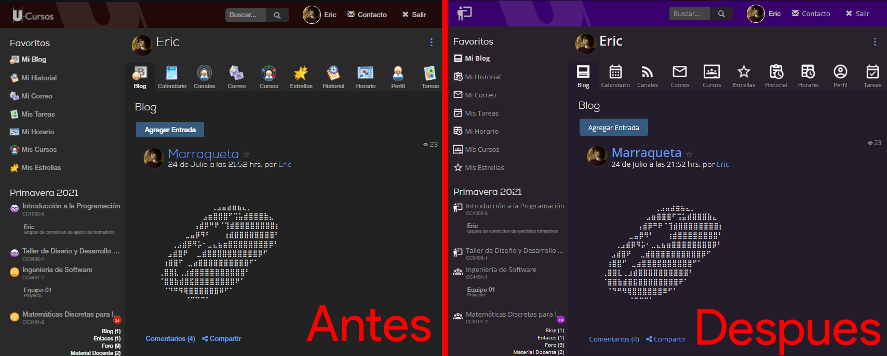

# tU-Cursos
Extension de Chromium y Firefox que agrega configuraciones de personalización y calidad de vida a U-Cursos.

# Carácteristicas

## ⚙ Todo es personalizable ⚙

En el menú de configuración de tU-Cursos, se puede deshabilitar cualquiera de las caracteristicas, y eliminar los datos guardados.

## 🔢 Contador de cursos compartidos 🔢

Por defecto al visitar una página de integrantes, se guardaran los datos de la página **localmente**. Estos datos luego se presentan como un número al lado del nombre de las personas. Este número corresponde al cantidad de cursos que compartes con esta persona.

Al pasar el mouse por sobre este número, se abre una vista detallada, mostrando los cursos en particular que se comparten, y el rol que la persona tenía en ese curso.

## 🚫 Esconder elementos 🚫

En la pestaña de "Esconder" en el menú de tU-Cursos, puedes esconder:

### El gráfico de tareas
 

### La vista previa del último post de blog al ver el historial

## 👁 Vista previa de PDFs de tamaño ajustable 👁

Haciendo *drag* desde la esquina inferior derecha se ajusta el tamaño del visor de PDFs.

## 🔮 Futuro 🔮

### 🎨 Personalización de íconos, colores y fonts 🎨

  

*Esta carácteristica aún no se ha implementado en la versión pública*

El proyecto sigue en alfa, y aun no tiene un release oficial. Tenemos varias ideas que se pueden ver en [issues](https://github.com/Nyveon/tU-Cursos/issues). Se aceptan colaboraciones, sugerencias, reportes de bugs y otros aportes!

Aquí hay una lista de algunas de las ideas:
 - 🖼 Marcos a las fotos de perfil según el rol de la persona en el curso.
 - 📆 Contador de semanas en el horario.
 - 🚪 Elección de la pestaña default de cada curso.
 - 🔗 Enlaces instantaneos en sección de enlaces.
 - 🎞 Vista previa de enlaces con imagenes y videos.
 - 👍 Contador de +1s/-1s en posts.
 - 🌟 Destacar gente.
 - 🚫 Esconder las burbujas de notificaiones.
 - 🚫 Censurar los nombres de las personas
 - 🚫 Censurar las fotos de perfil de las personas.
 - 🚫 Censurar los nombres y codigos de cursos.
 - ... Y Mucho mas

## ⚠ Descargo de responsabilidad ⚠

*Esta extensión es un proyecto por estudiantes, con fines recreativos y educacionales. No está afiliado con UCampus ni U-Cursos. No está oficialmente aprobado por U-Cursos, ni tampoco se ha diseñado para ser un sustituto a funcionalidades base de U-Cursos. Usar a su propia discreción.*
