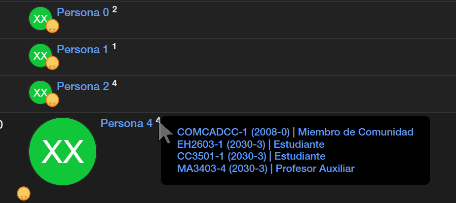
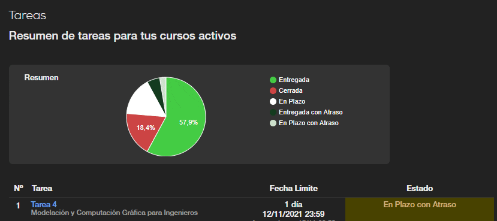
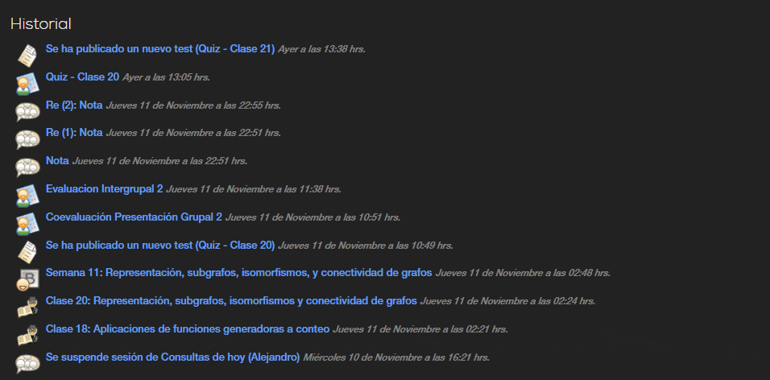
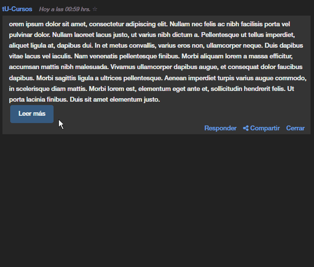
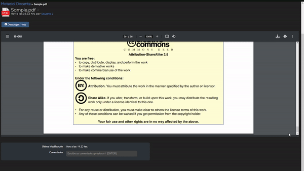
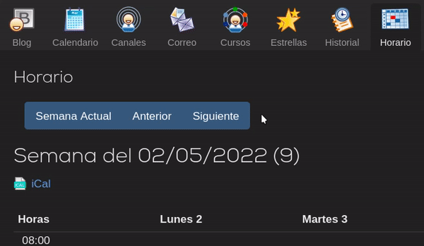
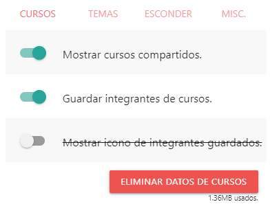

<h1><a href="https://github.com/Nyveon/tU-Cursos">tU-Cursos</a></h1>

Extension de Chromium y Firefox que agrega configuraciones de personalización y calidad de vida a U-Cursos. Desarrollado colaborativamente por [Eric K](https://github.com/Nyveon), [PuntitOWO](https://github.com/PuntitOwO), [sebcp](https://github.com/sebcp), [vmkovacs](https://github.com/vmkovacs), y [TaconeoMental](https://github.com/TaconeoMental). También ver [tUcampus](https://github.com/Nyveon/tUcampus) para Ucampus.

# Características:
## 🔢 Contador de cursos compartidos:
> Por Eric K

Por defecto al visitar una página de integrantes, se guardaran los datos de la página **localmente**. Estos datos luego se presentan como un número al lado del nombre de las personas. Este número corresponde al cantidad de cursos que compartes con esta persona.

Al pasar el mouse por sobre este número, se abre una vista detallada, mostrando los cursos en particular que se comparten, y el rol que la persona tenía en ese curso.

## 📊 Esconder el gráfico de tareas:
> Por Eric K

## 📝 Esconder la vista previa del último post de blog al ver el historial:
> Por vmkovacs

## ✂ Acortar mensajes largos
> Por sebcp

## 👁 Vista previa de PDFs de tamaño ajustable:
> Por PuntitOWO

Haciendo *drag* desde la esquina inferior derecha se ajusta el tamaño del visor de PDFs.

## 💬 Pop-Up de notas.
> Por sebcp

Editar una nota abre un Pop-up en vez de redirigir toda la página a la nota de ese estudiante en particular. Útil para ayudantes y auxiliares.

## 📅 Contador de Semanas
> Por TaconeoMental

## ⚙ Todo es personalizable:
> Por Eric K

En el menú de configuración de tU-Cursos, se puede deshabilitar cualquiera de las caracteristicas, y eliminar los datos guardados. Por defecto algunas cosas vienen habilitadas, pero no tienes que usar ninguna característica que no te guste!

# 🔽 Instalación:

Hasta que esté estable el proyecto, no recomendamos instalarlo. De todas formas, instalarlo no es muy complicado si descargas. (Clonar el repositorio, y dependiendo del navegador cargarlo así como extensión, o comprimirlo como zip y cargarlo)

# 🔮 Futuro y Contribución:

El proyecto sigue en alfa, y aun no tiene un release oficial. Tenemos varias ideas que se pueden ver en [issues](https://github.com/Nyveon/tU-Cursos/issues). Te interesa agregarle algo? Tienes alguna idea? Se aceptan y aprecian colaboraciones, sugerencias, reportes de bugs y otros aportes!
# ⚠ Descargo de responsabilidad:

*Esta extensión es un proyecto por estudiantes, con fines recreativos y educacionales. No está afiliado con UCampus ni U-Cursos. No está oficialmente aprobado por U-Cursos, ni tampoco se ha diseñado para ser un sustituto a funcionalidades base de U-Cursos. Usar a su propia discreción.*
